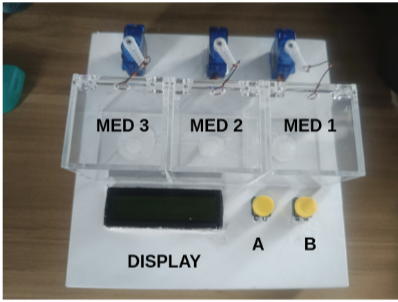
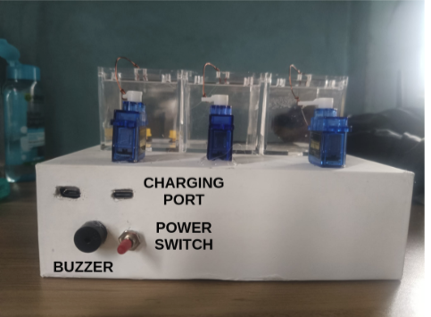
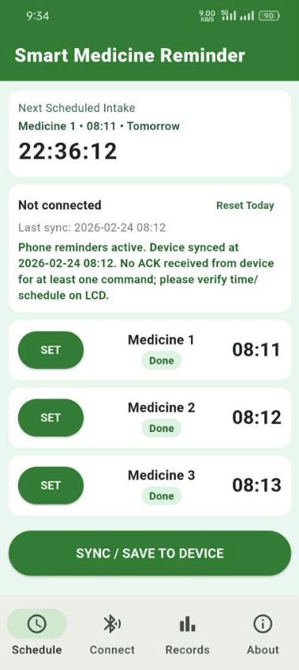

# Smart Medicine Reminder

> Offline medicine reminder system using an Android app + ESP32 pillbox (Bluetooth Classic SPP, RTC, servo compartments).





Add your real project pictures to `docs/images/` and keep these filenames, or update the paths above.

## Overview

Smart Medicine Reminder is an offline-first system designed for daily medicine intake reminders.

- **Android app** handles schedule setup, local reminders, records, and Bluetooth sync.
- **ESP32 device** stores schedule + clock and opens the correct compartment autonomously.
- **No Wi-Fi/cloud required** for normal operation.

## Current Features

### App (Android)
- Tabs: `Schedule`, `Connect`, `Records`, `About`
- Set 3 daily medicine times
- Sync schedule + time to ESP32 over Bluetooth Classic SPP
- Local phone notifications (exact alarms when allowed)
- Check/acknowledge medicine from app
- Daily intake records and summary

### Firmware (ESP32)
- Bluetooth Classic name: `Smart-Medicine-Reminder`
- DS3231 RTC support (time sync from app)
- Schedule persistence in NVS
- 3-servo compartment control
- Buzzer alert pattern for due medicines
- Patient buttons:
  - **Button A** (GPIO 32): acknowledge due medicine, close compartments, silence buzzer
  - **Button B** (GPIO 33, hold ~2s): toggle refill mode (open/close all)
- Patient-friendly LCD messages (16x2 I2C)

## Repository Structure

```text
app/        Flutter Android application
firmware/   ESP32 Arduino firmware + test sketches
docs/       Project docs, test logs, user manual
tools/      Optional helper files
```

## Hardware Summary

See full lists here:
- `components.md`
- `circuit.md`

### Firmware pin map (current)

- Servo 1: GPIO `25`
- Servo 2: GPIO `26`
- Servo 3: GPIO `27`
- Buzzer: GPIO `14`
- Button A: GPIO `32`
- Button B: GPIO `33`
- I2C SDA: GPIO `21`
- I2C SCL: GPIO `22`
- LCD I2C address: `0x27` (change in firmware if your module is `0x3F`)

## Important Power Notes

- Use a stable 5V supply for servos (typically 2A to 3A or higher depending on load).
- Keep **common ground** between ESP32 and servo supply.
- For refill operations, keep the device powered from the **rear USB Type-C port** for stable operation.
- Add a bulk capacitor (`470uF` to `1000uF`) near servo 5V/GND rails.

## Quick Start

### 1) Android App Setup

Prerequisites:
- Flutter SDK in PATH
- Android SDK installed
- Physical Android phone (recommended)

```bash
cd app
flutter pub get
cp android/local.properties.example android/local.properties
# edit android/local.properties with your SDK paths
flutter run -d <android-device-id>
```

Notes:
- Android 12+: grant Bluetooth permissions.
- Android 13+: grant notification permission.
- Enable exact alarms for best reminder timing.

### 2) ESP32 Firmware Setup

Main sketch:
- `firmware/smart_medicine_reminder/smart_medicine_reminder.ino`

Required Arduino libraries:
- `ESP32Servo`
- `RTClib`
- `LiquidCrystal_I2C`
- `BluetoothSerial` / `Preferences` / `Wire` (from ESP32 core)

Steps:
1. Open Arduino IDE.
2. Select ESP32 board profile.
3. Wire RTC/LCD/buttons/servos/buzzer based on `circuit.md`.
4. Upload firmware.
5. Open Serial Monitor at `115200` baud.

## Operating Flow

1. Power the device and open the app.
2. Go to `Connect` tab, connect to `Smart-Medicine-Reminder`.
3. Go to `Schedule`, set medicine times, tap `SYNC / SAVE TO DEVICE`.
4. At due time:
   - phone notification fires,
   - compartment opens,
   - buzzer alerts.
5. Acknowledge intake:
   - press **Button A** on device, or
   - tap the check button in app.

## Refill Mode

- To use refill mode safely, power the device through the **back USB Type-C port**.
- Hold **Button B** for ~2 seconds to enter refill mode.
- All compartments open and stay open.
- Hold **Button B** again for ~2 seconds to close and exit refill mode.

## Bluetooth SPP Protocol

### App -> Device
- `GET`
- `TIME,YYYY-MM-DD,HH:MM:SS`
- `SYNC,HH:MM,HH:MM,HH:MM`
- `SET,1,HH:MM` (or slot 2/3)
- `TEST,1` (or slot 2/3)
- `ACK,1` (or slot 2/3)

### Device -> App
- `OK,...`
- `SCHED,1,HH:MM,2,HH:MM,3,HH:MM`
- `ERR,BAD_FORMAT`
- `ERR,RTC_NOT_SET`
- `EVT,DUE,<m1>,<m2>,<m3>`
- `EVT,TAKEN,<m1>,<m2>,<m3>`
- `EVT,REFILL,ON|OFF`

## Build Release APK

```bash
cd app
flutter clean
flutter pub get
flutter build apk --release
```

Output:
- `app/build/app/outputs/flutter-apk/app-release.apk`

If you also need Play Store bundle:

```bash
flutter build appbundle --release
```

## Test Sketches

Firmware subsystem tests are available in:
- `firmware/tests/README.md`

Includes:
- Power/boot diagnostics
- Bluetooth-only stability
- RTC test
- Servo direction and calibration tools
- Servo sweep diagnostics

## Troubleshooting

### Device not found in Bluetooth scan
- Confirm firmware is running and device is powered.
- Confirm Bluetooth name is `Smart-Medicine-Reminder`.
- Try pairing once in Android Settings, then reconnect in app.

### LCD garbled or blinking
- Check power stability and common ground.
- Check I2C wiring (SDA 21 / SCL 22).
- Verify LCD address (`0x27` vs `0x3F`).

### ESP32 resets or brownout
- Usually power issue.
- Separate servo power from ESP32 logic power.
- Add capacitor near servo rail.

### Buzzer not audible
- Verify buzzer type and wiring to GPIO 14.
- Confirm shared ground.
- Check volume and mounting direction of buzzer module.

### Notifications delayed/missing
- Grant notification + exact alarm permissions.
- Disable aggressive battery optimization for the app.
- Reopen app and tap `SYNC`.

## Documentation

- System planning: `description.md`
- Hardware components: `components.md`
- Circuit wiring: `circuit.md`
- User manual: `docs/user_manual.md`
- Test log: `docs/test_log.md`
